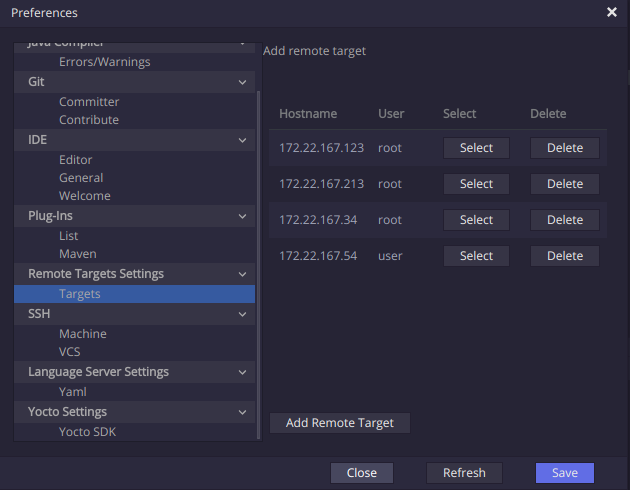

Plugins
-------

Currently, Kuksa IDE includes some plugins extending Eclipse Che's
functionality. Each plugin is explained in a sub-section below.

Remote Target
+++++++++++++

Remote Target plugin enables the user to Manage different development
boards (i.e. Raspberry Pi 3). The image below shows the preferences
view acccessible through *Profile > Preferences > Remote Target Settings > Targets*.

This plugin provides the following macros;

* :code:`${remote.target.hostname}`: Selected remote target's hostname (IP)
* :code:`${remote.target.user}`: Selected remote target's user name

These macros are possible to be resolved once a Remote target is selected in 
*Profile > Preferences > Remote Target Settings > Targets*.

Yocto Support
+++++++++++++

Yocto Support plugin enables the user to manage different Yocto SDKs. The 
image below shows the preferences view acccessible through 
*Profile > Preferences > Yocto Settings > Yocto SDK*.

.. image:: ../_static/yocto_sdk_demo.png
    :align: center

As part of the managing of the Yocto SDK, these are;

 * Being downloaded and installed, when added.
 * Being uninstalled, when deleted

For dowloading, installing, and uninstalling the Yocto SDK, a 
:code:`CustomSilentCommandExecutor` that executes command line
commands in the Workspace's running machine.

Morevoer, the plugin provides the following macros

 * :code:`${yocto.sdk.env.path}`: Path to the environement source file
 * :code:`${yocto.sdk.path}`: Path to the installation root directory

These macros can be only resolved when a Yocto SDK is selected 
through *Profile > Preferences > Yocto Settings > Yocto SDK*.

Additionally, this plugin provides a custom Eclipse Che command type,
which gives an initial template for using some Yocto SDK's plugin
macros. This template is accessible as shown in the image below.

.. image:: ../_static/yocto_sdk_custom_command.png
    :align: center

